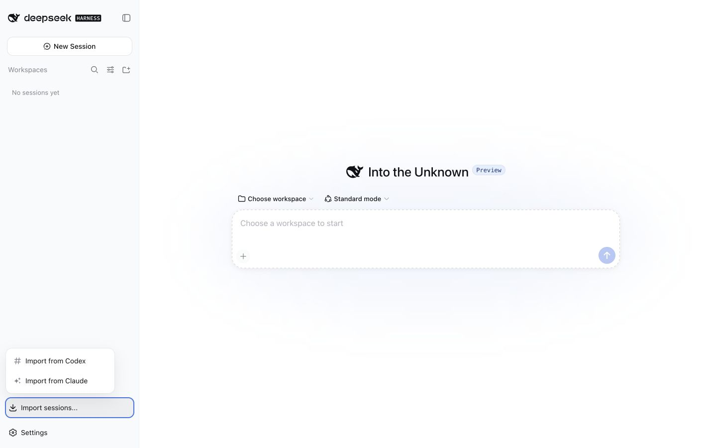
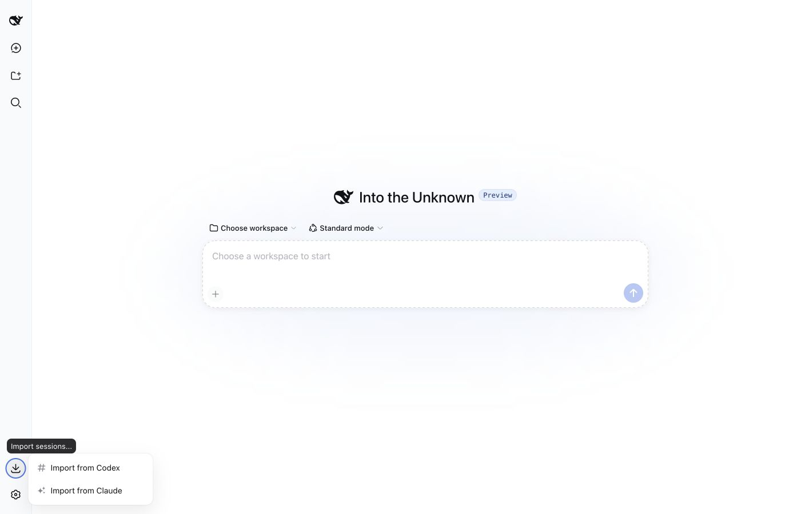

# UI Acceptance Evidence

## Environment

- Official DeepSeek Harness `0.1.1-rc.2`, commit `b150a551`.
- Local production builds of `relay-dsh-plugin-session-import@0.1.0`,
  `relay-dsh-plugin-codex`, and `relay-dsh-plugin-claude`.
- Isolated DSH `web` Profile at a 1415 by 900 browser viewport.

## Results

- The composed page contains exactly one `[data-session-import-hub]` trigger.
- The open menu contains exactly two ordered rows: `Import from Codex`, then
  `Import from Claude`.
- Each row closes the menu and opens only its provider's existing import dialog.
- The wide trigger and upward menu do not overlap Settings or Workspace content.
- The 36px rail trigger exposes a tooltip; its right-side menu is not clipped.

## Screenshots

